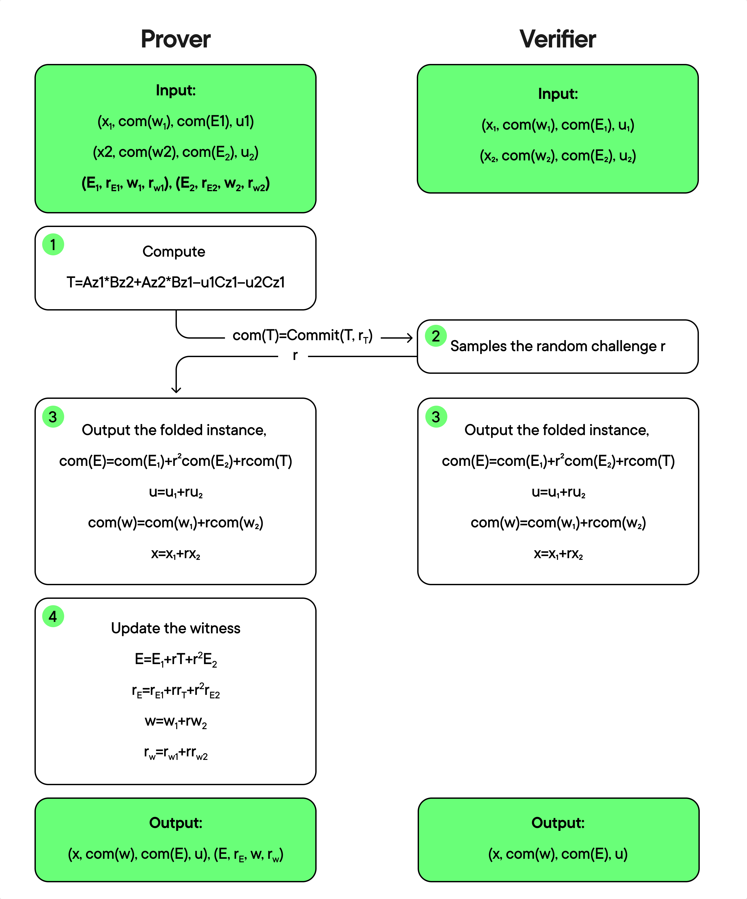

# The Use of IPA in Nova

Nova uses an Inner Product Argument (IPA), which uses Pedersen commitments. It does not need a trusted setup and its security is based on the discrete log problem (DLP). IPA is different from other common commitment schemes, such as KZG, which uses elliptic curve pairings and needs a trusted setup. For proof sizes and verification times, KZG is better since an IPA with Pedersen commitments needs linear work by the verifier, with proof size depending on the input (KZG’s proof and verification time are fixed). However, we can fix these weaknesses in systems like Halo.

An instance (that is, the public variables) for a committed relaxed R1CS is given by 𝑥, the public input and output variables, 𝑢 and the commitments to 𝐸, 𝑐𝑜𝑚(𝐸) and 𝑐𝑜𝑚(𝑤). We can put these in the tuple (𝑥, 𝑐𝑜𝑚(𝑤), 𝑐𝑜𝑚(𝐸), 𝑢). The instance is met by a witness (secret variables) (𝐸, 𝑟𝐸, 𝑤, 𝑟𝑤) if

<figure><figcaption></figcaption></figure>

where 𝑧 = (𝑤, 𝑥, 𝑢). Namely, the witness meets the instance if the public variables 𝑐𝑜𝑚(𝐸) and 𝑐𝑜𝑚(𝑤) are really the commitments to the private variables 𝐸, 𝑤 using randomness 𝑟𝐸, 𝑟𝑤, respectively and they follow the relaxed R1CS equations.

## The Folding Protocol

The prover and verifier can see two cases of relaxed R1CS, (𝑥1, 𝑐𝑜𝑚(𝑤1), 𝑐𝑜𝑚(𝐸1), 𝑢1) and (𝑥2, 𝑐𝑜𝑚(𝑤2), 𝑐𝑜𝑚(𝐸2), 𝑢2). Also, the prover has (𝐸1, 𝑟𝐸1, 𝑤1, 𝑟𝑤1) and (𝐸2, 𝑟𝐸2, 𝑤2, 𝑟𝑤2).

<figure><figcaption></figcaption></figure>

Fiat-Shamir method can be used to make the folding protocol presented above noninteractive. With this method, we can do IVC by updating the parameters after folding. The prover can then use a zkSNARK to prove that he has indeed the valid witness (𝐸, 𝑟𝐸, 𝑤, 𝑟𝑤) for the committed relaxed R1CS in ZK without revealing its value.
