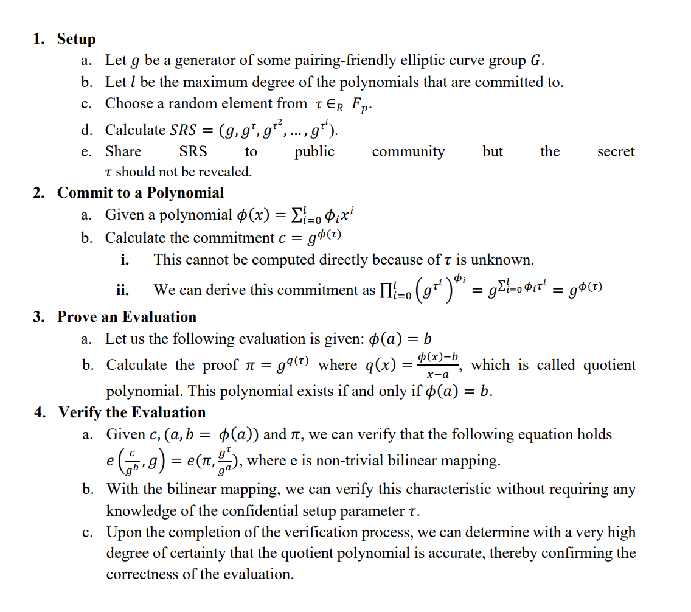

# KZG Polynomial Commitment

KZG stands for Kate-Zaverucha-Goldberg. It is a non-transparent polynomial commitment scheme that requires a trusted setup. It uses pairings and polynomial commitments to deterministically check the validity of a degree d polynomial using d queries. KZG can achieve very succinct proofs, but at the cost of higher prover time and interactive verification.&#x20;

KZG commitment has 4 different steps:

<figure><figcaption>
KZG commitment steps
</figcaption></figure>

This was a brief overview of the mathematical concepts involved in KZG, with some specifics omitted \[2,3].
