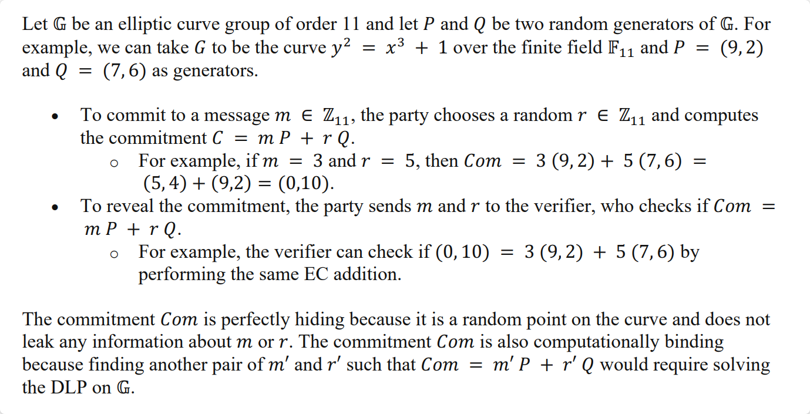

# Pedersen Commitments

## What are Pedersen commitments?

Pedersen commitments are a type of cryptographic commitment scheme used to commit to a value while preserving its privacy until it is revealed. They are widely used as a building block in many cryptographic protocols, including zkSNARKs. In a Pedersen commitment, a commitment to a value is made by computing a linear combination of two publicly known generators $$G$$ and $$H$$, where the coefficients of the generators are chosen based on the value being committed to and a random blinding factor.&#x20;

The resulting commitment $$Com$$ can be represented as $$Com(v,r) = rG + vH$$, where $$v$$ is the value being committed to and $$r$$ is the random blinding factor. The security of Pedersen commitments is based on the DLP assumption which ensures that an attacker cannot determine the value being committed to or the blinding factor used to construct the commitment, even if they have access to $$G$$ and $$H$$.

As said, they are often used in zkSNARKs to commit to polynomials or vectors of values, such as the witness or the input to a computation. By committing to the witness or input values, the prover can prove the knowledge of the solution to a computation without revealing the solution or any information about the witness or input. This enables private and efficient verification of computations, making Pedersen commitments an important building block in modern cryptographic protocols.

### A working example:

<figure><figcaption></figcaption></figure>

