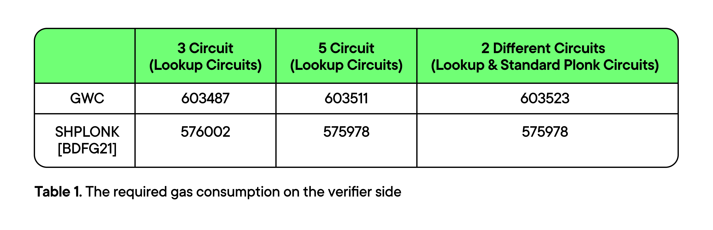

# Benchmarks

Our focus in this benchmark was solely on verifying the output on the smart contract. During this benchmark, we generated the following two simple circuits:

* The first one is a standard Plonk circuit
* The second one is a lookup circuit designed to verify a set of elements within a predefined lookup

<figure><figcaption></figcaption></figure>

The results of the benchmark are presented in Table 1. The comparison reveals that the verification of SHPlonk yields a gas requirement that is less than 5% of the GWC gas.
