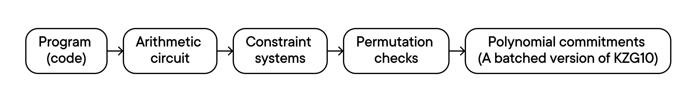

# Plonkish Protocols

Plonkish protocols, generally, look like this:

1. The prover sends commitments to some polynomials.
2. The verifier responds with some challenges.
3. The prover and the verifier repeat this for a number of rounds.
4. The prover opens these polynomials in some points, and the verifier checks some equations on these openings.

<figure><figcaption></figcaption></figure>

The equations are usually meant to apply to the polynomials and their rotations, where  and μ is a primitive root of unity of order 𝑛. Therefore, in general, to verify these equations, the verifier chooses a challenge point 𝑥 and prover reveals the values of the polynomials  at points  for  where  is the set of all rotated versions of  in the constraint.

## Notations

<figure><figcaption></figcaption></figure>
